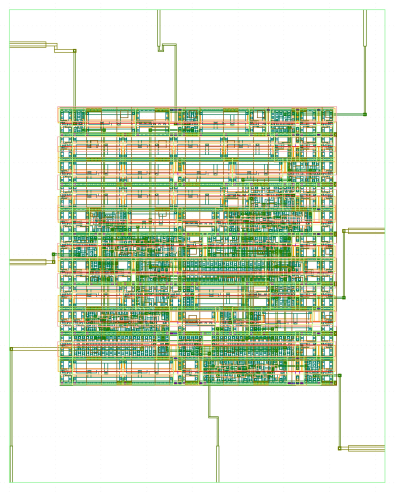
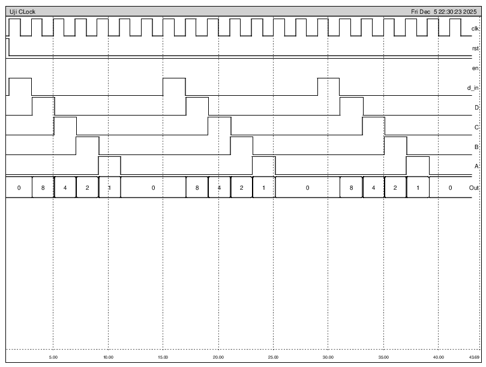
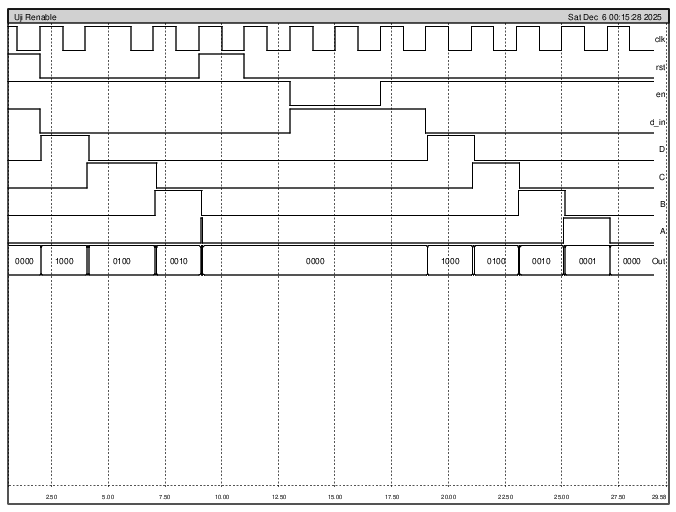

# VLSI_4Bit_Shift_Register
4-bit down counter designed in Verilog, implemented through OpenLane, and verified using IRSIM.

# 📚 Table of Contents
1. [Overview](#1-overview)
2. [Tools](#2-tools)
3. [How to Run](#3-how-to-run)
3. [Results](#4-results)

---

# 1. Overview
This project implements a 4-bit shift register using Verilog HDL, focusing on clock-driven data storage and bit-wise shifting behavior. The design is physically realized using the OpenLane flow with the SkyWater 130nm PDK, highlighting essential concepts in sequential digital circuit design.

The complete design flow covers RTL modeling, automated physical implementation, and post-layout verification. Functional correctness is validated using IRSIM, ensuring accurate data shifting behavior in the synthesized layout and reinforcing practical experience with open-source digital VLSI design workflows.

---
# 2. Tools
| Tool | Function | Status |
|------|----------|--------|
| **Magic** | VLSI layout editor | ✅ Core |
| **Irsim** | Digital Simulator | ✅ Core |
| **Docker** | Container platform | ✅ Core |
| **KLayout** | Layout viewer | ✅ Core |
---

# 3. How to Run

## 3.1 Run RTL to GDS
- Move the `4Bit_Shift_Register` folder into the `OpenLane/designs` directory.
- Open a terminal in the OpenLane root directory and run `make mount`.
- Execute the OpenLane flow using:
```bash
./flow.tcl -design 4Bit_Shift_Register
```
- Wait for the flow to complete successfully without errors.

## 3.2 Load Design
- Open Folder design Terminal
- in klayout `klayout fourbitshift.gds`
- in magic vlsi `magic fourbitshift.mag`

## 3.3 Run Simulation
- `irsim sky130A_tt_nom_27.prm fourbitshift.sim`
- in irsim terminal `source tb_clock.cmd` for **clock period testbench** and `source tb_renable.cmd` for **reset and enable** testbench


---
# 4. Results

## 4.1 Layout 4 Bit Shift Register from OpenLane
This figure shows the final physical layout of the **4-bit shift register** generated using the OpenLane **RTL-to-GDS** flow and viewed in Magic VLSI. The design is implemented using standard cells from the SkyWater 130nm library, featuring a structured arrangement of flip-flops and logic gates optimized for sequential data flow. Power rails, signal routing across multiple metal layers, and I/O pin connections are clearly organized, demonstrating a complete and DRC-clean digital physical design.

The layout reflects a successful transition from Verilog RTL to a hardware-ready GDSII file, where floorplanning and routing have been handled to minimize area footprint. This physical representation ensures that the 4-bit shifting logic is accurately mapped to silicon, maintaining the integrity of the data path while adhering to all manufacturing design rules.




## 4.2 Functional Simulation – Clock Period Test
The functional integrity of the design was first validated through a clock period test to ensure data shifts synchronously on every rising edge. As shown in the `tb_clock` waveform, the input bit `(d_in)` successfully propagates through the registers—transitioning from stage D to A—resulting in the expected decimal output sequence (8, 4, 2, 1). This confirms that the internal flip-flop connections are logically sound and that the setup and hold times are met within the simulated environment.

This simulation serves as the primary verification of the shift register’s core logic, proving that the digital flow from Verilog RTL to netlist is accurate. By observing the `Out` bus, you can see the seamless conversion of serial data into a 4-bit parallel representation. This step is crucial for ensuring that the timing constraints defined during the synthesis phase are respected in a practical operational scenario.




## 4.3 Functional Simulation – Reset and Enable Control
The robustness of the design is further demonstrated through the verification of the Reset (rst) and Enable (en) control signals. The `tb_renable` waveform illustrates that when the reset signal is asserted, the register immediately clears all stored values to zero, providing a reliable starting state for the hardware. Furthermore, the enable logic is shown to effectively "freeze" the state of the registers; when `en` is low, the data remains latched despite continuous clock toggling, which is vital for power-efficient operations.

These control features are essential for integrating this module into larger, more complex systems like CPUs or communication interfaces. The simulation results confirm that the control priority is correctly implemented, with the reset function taking precedence to ensure system stability. This comprehensive testing ensures that the hardware will behave predictably under various operational modes and control sequences.




--- 

<div align="center">

THANK YOU

</div>